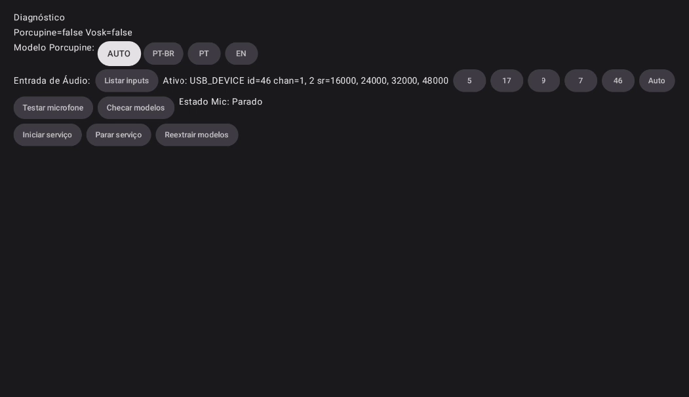
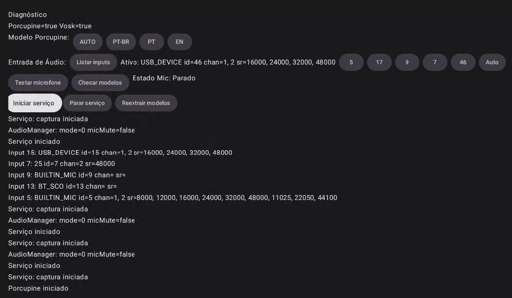

# Tasks: 001-assistente-de-voz

Feature Dir: D:\AndroidStudioProjects\OiArlete\specs\001-assistente-de-voz
Branch: 001-assistente-de-voz

Conventions:

- [P] = can run in parallel (different files/concerns)
- TDD = tests before implementation
- Use absolute paths below

## T000. Setup and Tooling

- [ ] T000-1 Setup Android TV emulator/device and SDKs [P]
  - Prepare Android TV AVD; ensure minSdk 26 runtime.
- [X] T000-2 Add dependencies and models [sequential]
  - Porcupine SDK, VOSK AAR, Retrofit/OkHttp or Ktor, AndroidX Test, Robolectric, MockWebServer.
- [X] T000-3 Project scaffolding (single-module) [sequential]
  - Create files: `app/src/main/java/com/example/oiarlete/{ArleteService.kt,WakeWordDetector.kt,SpeechRecognizer.kt,LlmManager.kt,ActionExecutor.kt,ConversationManager.kt}` and res/raw + assets dirs.
- [X] T000-4 Permissions and manifest [sequential]
  - Update `app/src/main/AndroidManifest.xml` with RECORD_AUDIO, WAKE_LOCK, FOREGROUND_SERVICE, INTERNET, RECEIVE_BOOT_COMPLETED and service/receiver declarations.

## T100. Contract Tests (before implementation) [P]

- [X] T101 Validate MCP request schema [P]
  - File: D:\AndroidStudioProjects\OiArlete\specs\001-assistente-de-voz\contracts\mcp.http.json
  - Create Android instrumented test using MockWebServer that serializes a valid request and validates against schema.
- [X] T102 Validate MCP response schema [P]
  - File: D:\AndroidStudioProjects\OiArlete\specs\001-assistente-de-voz\contracts\mcp.http.response.json
  - Instrumented test to assert response validation and error paths.
- [X] T103 Validate YouTube Music Intent contract [P]
  - File: D:\AndroidStudioProjects\OiArlete\specs\001-assistente-de-voz\contracts\ytmusic.intent.md
  - Robolectric/instrumented test to assert `ACTION_VIEW` with ytmusic:// or https fallback; handle app missing.

## T200. Integration Tests from User Stories (TDD) [P]

- [X] T201 Wake word → listen under 500ms [P]
  - Test service beeps and enters ActiveListening quickly on trigger.
- [X] T202 Play music via YouTube Music [P]
  - Test intent execution with provided query; fallback to search when direct playback not available.
- [X] T203 Simple Q&A via local path [P]
  - Short commands vão para LLM local e TTS fala resposta.
  - Tests: D:\AndroidStudioProjects\OiArlete\app\src\test\java\com\example\oiarlete\ConversationVoiceFlowTest.kt
- [ ] T204 Complex request via remote MCP [P]
  - Test longer query routes to MCP/LLM via HTTP; TTS speaks summarized response.
- [X] T205 Stop command and timeout [P]
  - "parar" retorna para Idle; timeout após ~15s retorna para Idle.
  - Implementado com timeouts baseados em coroutines e relógio virtual nos testes.
  - Tests: D:\AndroidStudioProjects\OiArlete\app\src\test\java\com\example\oiarlete\AsrControlAndTimeoutTest.kt

- [X] T207 ASR pause/resume during speaking [P]
  - Pausar ASR quando em Speaking e retomar após TTS completar; parar ASR em Idle.
  - Tests: D:\AndroidStudioProjects\OiArlete\app\src\test\java\com\example\oiarlete\AsrControlAndTimeoutTest.kt

- [X] T208 ASR active state & debounce [P]
  - Expor `SpeechRecognizer.activeFlow: StateFlow<Boolean>` e aplicar debounce leve nas transições do serviço para evitar thrashing de start/stop.
  - Tests: D:\AndroidStudioProjects\OiArlete\app\src\test\java\com\example\oiarlete\AsrActiveFlowTest.kt
- [X] T206 Reboot resilience [P]
  - Test BOOT_COMPLETED receiver starts ForegroundService.

## T300. Models and Core Services (driven by data-model)

- [ ] T301 Implement entities (data classes) [P]
  - File(s): D:\AndroidStudioProjects\OiArlete\specs\001-assistente-de-voz\data-model.md → app data classes.
- [X] T302 ConversationManager (state machine) [sequential]
  - Transições Idle/ActiveListening/Speaking; timeouts (listening/speaking) com coroutines; "parar"; listener + StateFlow para UI.
- [ ] T303 WakeWordDetector (Porcupine) [sequential]
  - Wrapper to start/stop stream, sensitivity config; callback to service.
  - Próximo: substituir stub por Porcupine, manter API atual (start/stop/setOnWakeListener), criar testes de integração com simulação de wake.
  - Status: scaffolding criado em `app/src/main/java/com/example/oiarlete/wake/PorcupineWakeWord.kt`.
- [ ] T304 SpeechRecognizer (VOSK) [sequential]
  - Streaming ASR PT-BR with start/stop tied to ConversationManager.
  - Próximo: substituir stub por VOSK/Whisper, respeitar start/stop e listeners; adicionar testes de streaming simulado.
  - Status: scaffolding criado em `app/src/main/java/com/example/oiarlete/asr/VoskRecognizer.kt`.
- [X] T305 LlmManager (router) [sequential]
  - Heuristic-based routing local vs remote; config thresholds.
- [X] T306 ActionExecutor (Intents/TTS/MCP) [sequential]
  - Executa intents do YT Music; TTS com pt-BR, foco de áudio (request/abandon), callbacks de conclusão; caminho MCP mantido mas depriorizado.
- [X] T307 ArleteService (ForegroundService) [sequential]
  - Lifecycle, wiring wake→ASR→Assistant; listener do ConversationManager para pausar/retomar/parar ASR conforme estado; expõe stateFlow para UI.

## T400. Endpoint/Integration Implementations

- [X] T401 Retrofit/Ktor client and models [sequential]
  - Configure base URL from SharedPreferences; API key header optional; timeouts 5s/15s.
  - Próximo: reativar caminho MCP quando local estiver estável; reabilitar testes @Ignore e alinhar Assistant para suportar LOCAL/REMOTE.
- [X] T402 YouTube Music intent integration [sequential]
  - ACTION_VIEW ytmusic://; fallback https search; TTS feedback if app missing.
- [X] T403 TTS initialization and playback [sequential]
  - setLanguage(pt-BR), onInit handling, play/flush behavior.

## T500. Tests & CI

- [X] T501 Unit tests for heuristic routing [P]
  - Short imperatives (≤8 tokens) & keywords → local; otherwise remote.
- [X] T502 Unit tests for ConversationManager [P]
  - Transitions, stop, timeout.
- [ ] T503 Integration smoke suite (CI) [sequential]
  - [X] T503a Unit tests (Robolectric) em CI: `./gradlew test` via GitHub Actions.
    - Workflow: `.github/workflows/android-ci.yml` (JDK 17, cache Gradle).
  - [ ] T503b Emulator workflow para smoke de intents/TTS/HTTP (instrumented tests).
  - Observação: testes locais unitários passam; falta pipeline com emulador.

## T600. Polish & Docs

- [ ] T601 Performance passes [P]
  - Threading caps, stop ASR when idle (feito), pre-warm TTS (feito via initTts), debounce transições ASR, métricas básicas.
- [ ] T602 Privacy/logging audit [P]
  - Ensure no audio persisted; logs without PII.
- [ ] T603 Update Quickstart and agent context [sequential]
  - Refresh quickstart.md and run update-agent-context script.

## Parallel Execution Guidance

- Example group 1 [P]: T101, T102, T103
- Example group 2 [P]: T201, T202, T203, T204, T205, T206
- Example group 3 [P]: T301, T501, T502, T601, T602

## Agent Commands

- Run prerequisites check:
  - .specify/scripts/powershell/check-prerequisites.ps1 -Json
- Update agent context after Phase 1:
  - .specify/scripts/powershell/update-agent-context.ps1 -AgentType copilot
